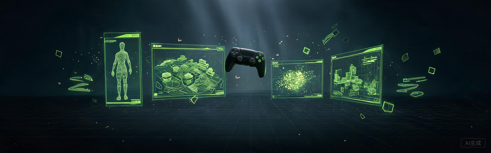

<!-- ═══════════════════════════ BANNER ═══════════════════════════ -->


<div align="center">

<!-- 打字机 -->


<!-- 访客统计 -->


</div>

---

## 🎮 PLAYER PROFILE · 玩家档案

```text
$ ./whoami --player

  ID       : HHL1571
  CLASS    : 游戏程序开发 / Gameplay Programmer
  BASE     : Xiamen · CN 📍
  BUFF     : 数字媒体出身 · 审美与工程双修
  STATUS   : 正在打磨 3 款原创游戏 Demo
  GUILD    : 厦门理工学院
```

<div align="center">

**数字媒体 × 游戏程序** —— 既能把 Niagara 特效调出电影感，也能用 C++ 把 Gameplay 框架撸到能跑。
从建模、渲染、后期到引擎编程的完整管线实战者。

</div>

---

## ⚔️ SKILL BARS · 技能面板

| | | |
| :--- | :--- | :--- |
|  |  | `Lv.8` 第三人称模板 / GAS / Niagara / PCG / Lumen |
|  |  | `Lv.7` UGUI / 物理系统 / 移动端优化 |
|  |  | `Lv.6` 2D 工作流 / 像素平台跳跃 |
|  |  | `Lv.5` 建模 / 材质 / 渲染管线 |

<!-- ═══════════════════════════ 装备栏 ═══════════════════════════ -->

## 🧰 INVENTORY · 装备栏

<div align="center">

<a href="https://skillicons.dev"></a>
<a href="https://skillicons.dev"></a>
<a href="https://skillicons.dev"></a>

</div>

---

## 🗺️ QUEST LOG · 当前任务

<table>
<tr>
<td width="33%" valign="top">

<!-- 任务一 -->


**《暗巷协议》** · UE5 第三人称射击

[](https://www.hhlportfolio.top/games.html)
[]()

> 角色运动 / 枪械系统 / 敌人 AI
> Lumen 全局光照，写实室内场景

</td>
<td width="33%" valign="top">

<!-- 任务二 -->


**未命名动作闯关** · Unity 原创项目

[](https://www.hhlportfolio.top/games.html)
[]()

> 硬核动作手感调校
> 关卡节奏与 Boss 战设计

</td>
<td width="33%" valign="top">

<!-- 任务三 -->


**像素平台跳跃** · Godot 轻量小品

[](https://www.hhlportfolio.top/games.html)
[]()

> 极致手感的一分钟快乐
> 小而完整的游戏循环

</td>
</tr>
</table>

<div align="center">

🎮 完整作品集（视频 / 渲染 / 三维展厅）→ **[www.hhlportfolio.top](https://www.hhlportfolio.top)**

</div>

---

## 🏆 ACHIEVEMENTS · 成就系统

<table>
<tr>
<td align="center" width="33%">
<div>🏆</div>
<b>省级未来设计师大赛</b><br/>
<sub>一等奖 · 数字媒体设计</sub>
</td>
<td align="center" width="33%">
<div>🥇</div>
<b>VR 技术应用竞赛</b><br/>
<sub>省市级 · 交互技术方向</sub>
</td>
<td align="center" width="33%">
<div>🎬</div>
<b>动漫制作 / 数字艺术</b><br/>
<sub>多项省市级奖项</sub>
</td>
</tr>
</table>

---

## 📊 GITHUB STATS · 战力面板

<div align="center">

<a href="https://github.com/HHL1571">

</a>
<a href="https://github.com/HHL1571">

</a>
<a href="https://github.com/HHL1571">

</a>

</div>

<!-- ═══════════════════════════ 贪吃蛇 ═══════════════════════════ -->

## 🐍 CONTRIBUTION SNAKE · 吞噬贡献图

<!-- 🐍 贪吃蛇贡献图：需要先启用 .github/workflows/snake.yml（见仓库说明），启用后取消下方注释
<picture>
  <source media="(prefers-color-scheme: dark)" srcset="https://raw.githubusercontent.com/HHL1571/HHL1571/output/github-contribution-grid-snake-dark.svg"/>
  <source media="(prefers-color-scheme: light)" srcset="https://raw.githubusercontent.com/HHL1571/HHL1571/output/github-contribution-grid-snake.svg"/>
  
</picture>
-->

<div align="center">

<i>"Talk is cheap. Show me the game."</i><br/>
<sub>— 致敬 Linus Torvalds</sub>

</div>

---

## 📡 CONTACT · 联系方式

<div align="center">

[](https://www.hhlportfolio.top)
[](mailto:15710609807@163.com)
[](https://github.com/HHL1571)

</div>

---

<div align="center">
<sub>Made with 🎮 &amp; ⌨️ by HHL1571 · 厦门</sub>
</div>
